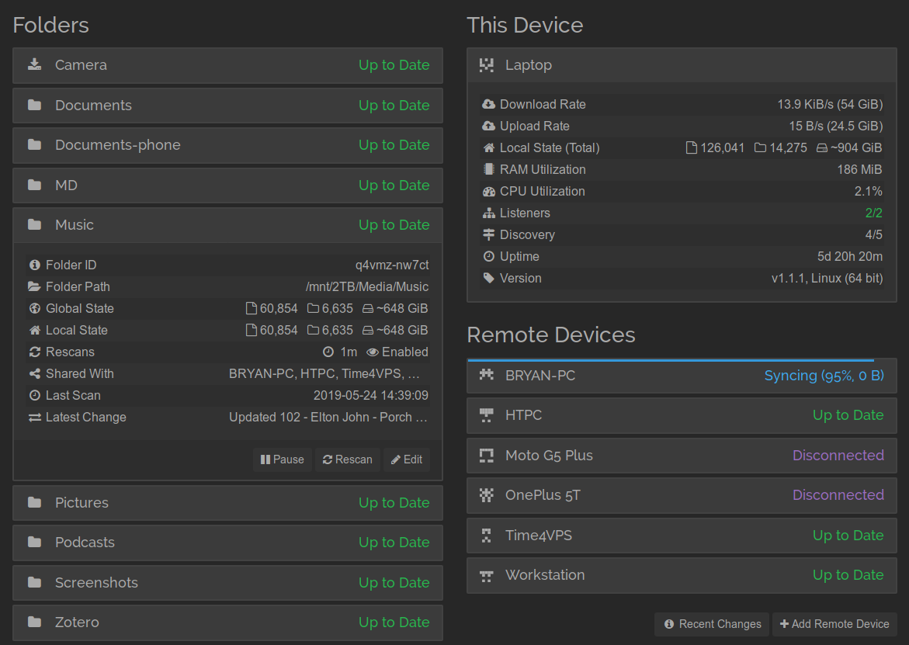

### Introduction

My goals for using JRiver Media Center (JRMC) successfully are as follows:

1. Enjoy my music when I want, where I want
    - Make it easy to access
    - Keep my media library organized
    - Make it easy to add and remove media
    - Keep my media library consistent across many devices
2. Minimize the impact on my home's bandwidth and ISP data caps
3. Provide a redundant cloud backup of my media
4. Make it stable
5. Make it automated

In the course of achieving these goals, my VPS-based JRMC configuration has been in a state of flux for several years. However, I have eventually settled into a configuration that I have found works very well, which I will outline in this article.

### Prerequisites

1. You have a VPS running a full Linux distribution, likely a **storage VPS** that you can use to store the entirety of your media/music library. I run JRMC on a 1TB RAID6 storage VPS from [Time4VPS (referral link)](https://www.time4vps.com/?affid=4115) that costs about $80/yr. It comes with 1GB of RAM, 1 vCPU, and 20TB of bandwidth, which is enough resources to run JRMC in addition to several other services (including the site you are reading this on). It's not fast and you must be conscious of memory management, but it works.

2. You have a **running X server** (required by JRMC) and some form of **remote desktop access** to the server for managing JRMC. If you don't (or have no idea what I just said), freshen yourself up on SSH and follow [my guide on configuring a lightweight headless X2Go server for managing remote GUI applications]({{ site.baseurl }}).

3. A **JRMC Master or Linux license**.

### Pairing JRMC Media Server with continuous file synchronization

JRMC contains a powerful [Media Server](https://wiki.jriver.com/index.php/Media_Server) that enables clients to play and manage media in JRMC as if they were using a local copy of the library. It is certainly possible to use Media Server exclusively to manage and play your media from the server to your clients.

JRMC Media Server pros:
1. Tag changes are synced seamlessly between all devices
2. Client devices are easy to add/remove

JRMC Media Server cons:

1. Bandwidth and latency. Media must always be streamed from the server to the playback clients, which means that clients must have internet connectivity to access the library. I travel frequently so streaming is not always a feasible option. Also, file operations will not be as responsive as using a local library because the library will need to buffer media during playback and sync tag changes.
2. Adding new music to the server must still be done through a third-party tool (e.g. sftp, rsync, etc.)

Con #1 can be alleviated by maintaining a duplicate local copy of the media files on a client device and enabling the option to *Options>Media Network>Client Options>Play local file if one that matches Library Server file is found* on the client's copy of JRMC. This option necessitates that the directory and filename structure on the client is identical to the server's (which makes it problematic for clients and servers running on different platforms, hopefully this limitation can be fixed at some point in the future by the JRMC developers).

However, both cons can be eliminated simultaneously if we introduce a third-party tool to keep the media libraries continuously in sync, so that 1) newly added media is propagated between the server and clients and 2) directory structure and filenames are always identical. The answer here is [syncthing](https://syncthing.net/), an open-source multi-platform tool for continuous file synchronization between many clients.

### Syncthing

Syncthing is easily the most important tool in my arsenal to keep all of my various devices working in harmony. I use it on my smartphone (well, [syncthing-fork](https://f-droid.org/en/packages/com.github.catfriend1.syncthingandroid) for better battery life) to sync podcasts, photos, and documents to my laptop and desktop. I use it on my high-performance workstations to create rolling off-site backups. I use it on my servers to share configuration settings and dotfiles. Every second of every day I have bytes floating through the proverbial syncthing cloud and it has yet to fail me.

Syncthing configuration is relatively straight-forward, thus I will not go into much depth here other than to highlight a few important settings for improving the reliability. If you have a client device that will not be adding or tagging media (in essence, a read-only client), then make sure to set the syncthing share to "receive only" instead of the default "send and receive," which will save a few cpu cycles and prevent read-only clients from accidentally altering your media library. Additionally, make sure that the filesystem watcher is enabled so that any changes to your media files are propagated as quickly as possible to other devices.

At this point you will have a fully in-sync media library residing on one or more computers. The biggest advantage here is that you can now add and manage media on any local computer and have it automatically synced to your VPS. The real magic comes next when we start using JRMC to apply changes to file tags, which will also be propagated to other devices since tag changes will alter the file checksums. Since Syncthing is a block-based synchronization tool, any changes to a file's tags will not necessitate the entire file to be transferred to other clients, only a small block of data (typically a few KB), which makes it fast and bandwidth-friendly.

### Client-client (local libraries) versus the traditional server-client model

Now that the actual media files are in sync, it's time to decide if you want to utilize the traditional server-client model with a master JRMC library residing on the VPS serving various clients via JRMC Media Server (i.e. **server-client**) or to allow each device to maintain their own library (with tag changes kept in sync via syncthing) (**client-client**).

Although we configured JRMC to use local file playback in the previous section, thereby saving bandwidth and improving latency, Option 1 still requires internet connectivity for clients to connect to the JRMC Media Server, which limits its reliability. Since syncthing is keeping all files and tags consistent on our devices, it is possible to maintain nearly-identical local libraries on the clients, with one big caveat:

**When using the client-client model, traditional playlists will not be automatically synced among clients** since they are stored in the JRMC library and are only exported as files when manually triggered.

**Rant:** *On several occasions, I have asked the JRMC developers to consider adding an automatic playlist export core command so that syncthing could also sync the playlist files, but they have chosen not to do so thus far. You can get close by using [the RESTful MCWS interface](https://wiki.jriver.com/index.php/Web_Service_Interface) and appropriate [JRMC core command](https://wiki.jriver.com/index.php/Media_Center_Core_Commands): `curl -s -o /dev/null -u username:password http://localhost:52199/MCWS/v1/Control/MCC?Command=20004,1`, however MC will still prompt you for the export directory and playlist format so it cannot be automated.*

However, I will describe a method later on in this guide that can replace some playlist functionality using JRMC smartlists and file tags.

### Tagging is the key to the client-client model

The real magic here is to store as much information as possible in the file tags so that they are synced via Syncthing between JRMC clients. This can include basic information like ratings, artwork, audio analysis data (R128 normalization) or more advanced information like user-defined fields that can be used to keep smartlists in sync (see [Advanced tagging](#advanced-tagging) below for more information).

##### Sending metadata
To propagate changes from a client to other clients, we will need to enable *Edit>Edit File Tags When File Info Changes* on any JRMC client that we want to have read-write access to the file metadata. If you leave this option unchecked on a client then that client will maintain its own set of metadata in the JRMC database without propagating changes. If you want to edit the actual file tags without affecting other clients (e.g. you are moving files on the client to a handheld device), then go ahead and enable the option but set your syncthing client to Receive Only so that it maintains its own local database state. I also recommend enabling automatic file tagging during file analysis upon Auto-Import *Options>Library & Folders>Configure auto-import>Tasks>Write file tags when analyzing audio...* so that analysis only needs to be performed once on the client that performs the initial file import.

##### Receiving metadata

In order to receive metadata updates from other clients, you'll want to use JRMC Auto-Import to watch the Syncthing music directory for changes and enable *Options>Library & Folders>Configure auto-import>Tasks>Update for external changes*.

### Advanced tagging

Here I will describe two examples of expanding the functionaility of the client-client model using file tags.

##### Tracking newly added media

Sometimes it is useful to keep track of which client has added a particular file to the Syncthing network. You can do this by creating a custom user-defined string field in JRMC (*Options>Library & Folders>Manage Library Fields*) and name it something akin to *Imported From*. Then configure each client to apply their specific client name to the field upon auto-import: In *Options>Library & Folders>Configure auto-import* select your auto-import directory that you are sharing with Syncthing, click *Edit...* and under *Apply these tags (optional)>Add>Custom* select the field you just created and enter the client name as the value. For instance I have named my clients *HTPC*, *Laptop*, *VPS*, and *Work*. In this manner you can track where your files were orginally imported from.

It can also be useful to use a smartlist to track newly imported media to make sure that you actually listen to it before it falls to the proverbial wayside. In this case, follow the strategy above to create a check field called *Newly Imported* that is tagged as "1" upon auto-import. Then just create a smartlist on each client that lists files with a *Newly Imported* value of 1 (optionally sorted by \[Date Imported\]). After you watch or listen to the file, simply clear the *Newly Imported* field to remove it from the smartlist on every client!

##### Smartlists as pseudo-playlists

As I outlined above it is possible use file tags in conjunction with smartlists to keep advanced file information and file lists in sync between clients. In this manner it is also possible to partially restore the ability to sync playlists between clients. In order to do this, create a new User Field named *User Playlists* with a data type of *List*. Use this field to create a semi-colon delimited list of pseudo-playlists. On each client, create a smartlist that only displays files with the matching string in the *User Playlists* field. When you want to add a file to the pseudo-playlist, simply add that playlist string to the *User Playlists* field. One drawback of this method is that it is not easy to manually reorder the smartlist for specific track ordering, but it can be done if necessary using additional user fields and/or smartlist rules.