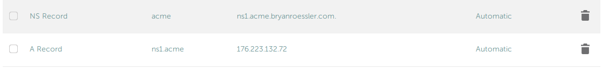

In early 2018, [Let's Encrypt](https://letsencrypt.org/) began issuing wildcard HTTPS certificates (e.g. for \*.bryanroessler.com), which vastly simplified the process of securing multidomain personal websites for free. The main drawback is that LetsEncrypt requires users to renew their site certificates every three months, which can be a headache if users handle renewals manually. Programs like [certbot-auto](https://certbot.eff.org/docs/install.html) can automate the certificate renewal process but the implementations for wildcard domains have been flaky in the past. An additional complication is that not every DNS provider (like Namecheap) support APIs that allow [ACME challenges](https://ietf-wg-acme.github.io/acme/draft-ietf-acme-acme.html) or may require users to pay an additional fee ($50/mo) for access.

**Luckily, it is possible for users to run their own DNS authentication server using [acme-dns](https://github.com/joohoi/acme-dns), which completely bypasses DNS provider limitations.**

### Overview

We will be running a small DNS server called acme-dns to respond to challenges issued by LetsEncrypt's certbot. You can run acme-dns on any computer, but typically it will run on the same host server as your website. Certbot will issue an ACME DNS challenge to your DNS provider, which will then forward the request (via some complicated (not really!) redirects) to your acme-dns server.

### Assumptions

You have a running web server that is properly configured to handle your site certificates. You are probably using Namecheap as a DNS host because you are deep enough in Google's search index to find my site.

### Prerequisites

I am using Ubuntu 16.04 for this tutorial, but it should not matter which distro you are using as long as you know how to modify the firewall and install the appropriate software from your package manager.

1. Install a recent version of Certbot (via the PPA or EPEL)
2. Install a recent version of golang-go (PPA is best option)
3. Install acme-dns: `go get github.com/joohoi/acme-dns/…`
4. Move the binary somewhere sensible since we will be using a systemd service: `sudo cp ~/go/bin/acme-dns /usr/local/bin/acme-dns`
5. Make the necessary directories: `sudo mkdir /etc/acme-dns/ /var/lib/acme-dns`
6. Make sure you've removed any existing \_acme-challenge DNS records from your DNS host records

### acme-dns configuration
1. Create the following file, substituting your site's domain name for <yoursite\> and your server's IP address (yes the naming scheme is dumb, but leave "acme.", "ns1.acme.", etc):

```
#/etc/acme-dns/config.cfg
[general]
# DNS interface
listen = ":53"
protocol = "udp"
# domain name to serve the requests off of
domain = "acme.<yoursite>.com"
# zone name server
nsname = "ns1.acme.<yoursite>.com"
# admin email address, where @ is substituted with .
nsadmin = "admin.<yoursite>.com"
# predefined records served in addition to the TXT
records = [
    "acme.<yoursite>.com. A 176.223.132.72",
    "ns1.acme.<yoursite>.com. A 176.223.132.72",
    "acme.<yoursite>.com. NS ns1.acme.<yoursite>.com.",
]
debug = false

[database]
engine = "sqlite3"
connection = "/var/lib/acme-dns/acme-dns.db"

[api]
api_domain = ""
ip = "127.0.0.1"
disable_registration = false
autocert_port = "80"
port = "8081"
tls = "none"
corsorigins = [
    "*"
]
use_header = false
header_name = "X-Forwarded-For"

[logconfig]
loglevel = "debug"
logtype = "stdout"
logformat = "text"
```
A short explanation: you are configuring acme-dns to listen to DNS requests (from certbot via Namecheap) globally on the standard DNS port 53 and configuring the HTTP port for certbot to talk to acme-dns on port 8081 (since you are probably running something way cooler on port 8080).
2. Since certbot has to traverse Namecheap to perform the challenge, we will need to open port 53 in the firewall (traffic on port 8081 is handled on the localhost, so we don't need to open that port): `sudo ufw allow 53/udp && sudo ufw reload`


3. Let's start the acme-dns program automatically on startup. Create:

```
# /etc/systemd/system/acme-dns.service
[Unit]
Description=Limited DNS server with RESTful HTTP API to handle ACME DNS challenges easily and securely
After=network.target

[Service]
ExecStart=/usr/local/bin/acme-dns
Restart=on-failure

[Install]
WantedBy=multi-user.target
```

Note (Ubuntu 17.04+): you can security-harden the above script on distros running newer kernels by executing as a non-privileged user in conjunction with the `AmbientCapabilities=CAP_NET_BIND_SERVICE` line. However, older kernels will cause systemd to choke on that line during service startup. If you choose to execute as a non-root user make sure to chown the `/etc/acme-dns/` and `/var/lib/acme-dns` directories!

 4. Enable the service to run on startup and run it now: `sudo systemctl daemon-reload && sudo systemctl enable --now acme-dns.service`

Great, now you've got a DNS authentication server that can respond to ACME challenges! You just saved yourself $50/month!

### Initial Namecheap configuration

You will need to add two DNS records:

1. an NS record for acme.<yoursite\>.com pointing to ns1.acme.\<yoursite\>.com
2. a record for ns1.acme.<yoursite\>.com pointing to the public IP address of your host

Example: 

### Configuring the Certbot auth hook

Now you just need to get certbot and acme-dns to work together!

1. Install python2 requests: `sudo apt-get install python-requests`
2. Acquire the acme-dns certbot hook file: `sudo wget -O /etc/letsencrypt/acme-dns-auth.py https://raw.githubusercontent.com/joohoi/acme-dns-certbot-joohoi/master/acme-dns-auth.py`
3. Configure the program you just downloaded: `sudo nano /etc/letsencrypt/acme-dns-auth.py` and change `ACMEDNS_URL = "http://localhost:8081"`

### Run Certbot

You will need to run certbot manually one time in order to be able to run `certbot renew` in the future to handle the certificate renewals manually. If you've followed the rest of this tutorial, go ahead and run certbot to acquire your certs:

`sudo certbot certonly -d "*.<yoursite>.com" -d "<youresite>.com" --agree-tos --manual-public-ip-logging-ok --server https://acme-v02.api.letsencrypt.org/directory --preferred-challenges dns --manual --manual-auth-hook /etc/letsencrypt/acme-dns-auth.py --debug-challenges`

When you run the command certbot will prompt you to add one more DNS CNAME record to your DNS host.

Example: `_acme-challenge.<yoursite>.com CNAME ch30791e-33f4-1af1-7db3-1ae95ecdde28.acme.<yoursite>.com.`

Create a new CNAME record named `_acme-challenge` and give it a value of `ch30791e-33f4-1af1-7db3-1ae95ecdde28.acme.<yoursite>.com.`

Wait a few minutes and hit <Enter\> to complete the ACME challenge and receive your certificates!

### Automation

The step I'm sure you've been waiting for.

1. Create the certbot-renew.service (if you are using Apache in lieu of nginx, substitute "nginx" with "httpd"):

```
#/etc/systemd/system/certbot-renew.service
[Unit]
Description=Certbot Renewal

[Service]
ExecStart=/usr/bin/certbot renew --post-hook "systemctl restart nginx"
```
2. Create the associated timer file to run the renewal weekly:

```
#/etc/systemd/system/certbot-renew.timer
[Unit]
Description=Timer for Certbot Renewal

[Timer]
OnBootSec=300
OnUnitActiveSec=1w

[Install]
WantedBy=multi-user.target
```
3. Enable the timer: `sudo systemctl enable certbot-renew.timer`

### What the hell is going on here?

A wild goose chase:

1. LetsEncrypt first asks your <yoursite\>.com domain for the TXT record at \_acme-challenge.example.com to complete the challenge
2. The Namecheap DNS server responds with a CNAME record that points to ch30791e-33f4-1af1-7db3-1ae95ecdde28.acme.<yoursite>.com, so LetsEncrypt goes there instead
3. The authoritative DNS server for \*.acme.<yoursite\>.com is ns1.acme.<yoursite\>.com, which points at your server IP (running acme-dns)
4. LetsEncrypt can finally ask ns1.acme.example.com what is the TXT record for ch30791e-33f4-1af1-7db3-1ae95ecdde28.acme.<yoursite\>.com and acme-dns will answer that question

### Additional Considerations
On a critical server it may be a good idea to start and stop acme-dns (and open and close port 53) alongside certbot execution. This can be handled fairly trivially with systemd `Requires=`, but I'll leave that up to you!

### Conclusions
Congratulations! You have successfully enabled automatic LetsEncrypt site certificate renewal on a finicky DNS host provider!
