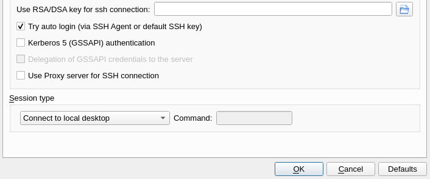

While it is certainly preferable to manage server applications via the terminal, sometimes it is not feasible for programs that rely on a GUI for their function. In this example I am using [JRiver Media Center](https://yabb.jriver.com/interact/index.php) as a media server for my audio and video files located on a remote VPS. Streaming to my devices from the VPS prevents me from saturating my home upload bandwidth or risk going over my ISP data caps. However, JRiver Media Center requires an existing X server to run its media server, and resources on the VPS I am using are tight (1GB RAM and 1 vCPU).

Luckily it is not necessary to run a full DE on a headless server in order to satisfy such program's requirements.

In this tutorial we will be setting up a headless X server that utilizes autologin, [Openbox WM](http://openbox.org/wiki/Main_Page), and X2Go to provide a lightweight GUI-based remote administration portal that also satisfies the requirements of JRiver Media Center's media server.

### X2Go versus VNC

TigerVNC can create its own X server using its virtual framebuffer, so it is the most commonly recommended solution for starting a remotely accessible X session. However, I prefer to use X2Go as my go-to remote desktop software on Linux due to its easy setup, performance, strong security (since it utilizes the existing ssh stack), and multi-platform client availability. It is also much easier for end users to configure because it does not rely on them to set up SSH tunnels to securely access the remote desktop. Additionally, X2Go utilizes the [NX protocol](https://en.wikipedia.org/wiki/NX_technology) which offers superior performance, latency, and quality than VNC. Another interesting option on the horizon is [Apache's Guacamole](https://guacamole.apache.org/), which uses HTML5 to provide remote desktop capabilities in the client's browser, but in this article I will be sticking to X2Go.

### Display Manager (or not)

In most situations, a display manager alleviates a lot of headaches regarding user login, starting X, and handling process management. However, since we are trying to minimize resource usage on the server for the purposes of this tutorial, we will be avoiding the additional overhead of a display manager and instead use systemd to autologin and then launch the X session.

### Window Manager

Using a window manager will simplify launching and maintaining your graphical programs. There are many to choose from, in this tutorial I will be using openbox due to its wide adoption and low memory footprint.

### Prerequisites

1. Install x2go, a window manager, and a terminal emulator: `sudo apt-get install x2goserver python openbox xterm`

2. Configure your SSH server and firewall for remote access. For testing, password-based authentication is OK, but eventually you will want to switch to using SSH keys for security and ease-of-use.

### Enabling autologin

We will be using getty to handle autologin for our user. In order to do this, we must override the default getty settings which normally prompts for a username and password upon login.

1. `sudo systemctl edit getty@tty1`

This will open your default system editor to create an override service file for the systemd getty@tty1.service.

2. Enter the following into the drop-in override file you just opened/created and save it (replacing username with your actual username):

```(text)
[Service]
Type=simple
ExecStart=
ExecStart=-/sbin/agetty --autologin username --noclear %I $TERM
```

3. Reload, restart, and enable the service file to load on boot: `sudo systemctl daemon-reload && sudo systemctl restart getty@tty1 && sudo systemctl enable getty@tty1`

Your system will now autologin the user you specified when you reboot!

### Starting the graphical X server automatically

In order to run a graphical program or window manager, you will first need to initiate an X server. We can start one automatically using a shell profile file that is sourced during user login. The location of this file (e.g. `/etc/profile.d/`, `~/.profile`, `~/.bash_profile`, `~/.zprofile` (zsh), etc.) depends on your Linux distribution and shell settings. Here I am assuming that you are using bash shell (you can confirm this via the `echo $SHELL` command), thus we will place the relevant commands in `~/.bash_profile`.

1. Add the following to the end of your `~/.bash_profile`:

```(bash)
# Start X11 automatically
if [[ -z "$DISPLAY" ]] && [[ $(tty) = /dev/tty1 ]]; then
        . startx
        logout
fi
```

Now that the X server is set to run on login, it needs to be configured to start your window manager, in this case Openbox.

2. Add the following line to `~/.xinitrc` and save the file:

```(bash)
exec openbox-session
```

Now your server is configured to automatically login, start an X server, and run Openbox!

### Using systemd to automatically start your GUI programs

It's certainly possible to use Openbox to autostart your server's GUI programs by adding its start command to `~/.config/openbox/autostart`; however, on a server it is preferable to use systemd to reliably manage programs as services (e.g. Openbox will not automatically restart crashed programs).

Here are the necessary steps to create and activate a systemd service file to start and stop JRiver Media Center.

1. Create the file `/etc/systemd/system/jriver.service` and add the following (replacing username with your username):

```(text)
[Unit]
Description=JRiver Media Center 25
After=graphical.target
#
[Service]
Type=simple
Environment=DISPLAY=:0
User=username
ExecStart=/usr/bin/mediacenter25 /MediaServer
Restart=always
RestartSec=10
KillSignal=SIGHUP
TimeoutStopSec=45
#
[Install]
WantedBy=graphical.target
```

The key here is the `After=graphical.target` condition that will launch the program only after X has started. There are plenty of additional systemd options that can be used for sandboxing or to improve process management using PID files, but that is outside the scope of this article.

2. Reload, restart, and enable the service file to load on boot: `sudo systemctl daemon-reload && sudo systemctl enable --now jriver.service`

### Testing the remote desktop using X2Go

At this point, go ahead and reboot the server in order to test it, using X2Go to connect using your SSH credentials. In the session preferences, ensure that the session type is set to "Connect to local desktop". If the session window appears to be an empty black box, try right-clicking to bring up the Openbox context menu.



### Conclusions

In this tutorial you have learned how to autologin a user, start the X display server, launch a lightweight window manager, enable a GUI service using systemd, and connect to the remote desktop you created using X2Go. Very cool!
